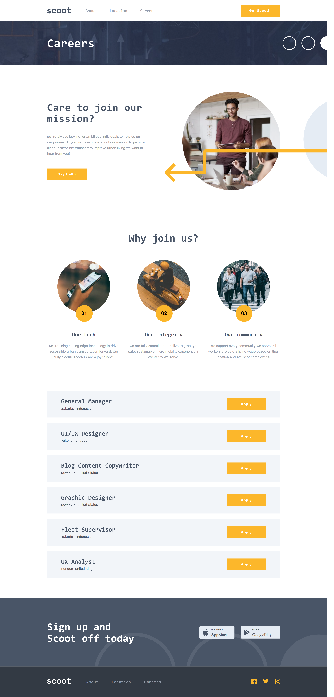
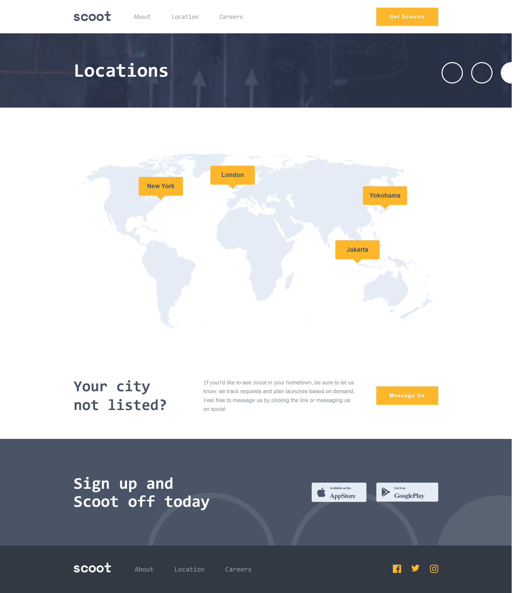

 #                                         Scoot Multi-Page Website

   ## Overview
   Scoot is a responsive multi-page website built from a Figma design challenge.
   The project follows a mobile-first approach and demonstrates modern front-end
   development practices, including reusable SCSS architecture, responsive layouts,
   and interactive JavaScript components.

   ## Live Demo
   --Live Site URL:
    https://tetiana1990.github.io/Scoot-multi-page-website/

   --GitHub Repository:
   https://github.com/Tetiana1990/Scoot-multi-page-website.git

   ## Pages

   - Home
   - About
   - Careers
   - Locations

  ## Features

  - Responsive design for mobile, tablet, and desktop devices
  - Mobile navigation menu
  - Interactive FAQ accordion
  - Multi-page navigation
  - Reusable SCSS components
  - Semantic HTML structure
  - Optimized images and assets
  - Hover and focus states for interactive elements

   ## 📸 Project Screenshots (Pages)

<table width="100%">
  <tr>
    <td width="50%" align="center">
      <b>🏠 Home </b>  
          
    </td>
    <td width="50%" align="center">
      <b>ℹ️ About</b>  
      
    </td>
  </tr>
  <tr>
    <td width="50%" align="center">
      <b>🛍️ Careers</b>  
      
    </td>
    <td width="50%" align="center">
      <b>🔍 Locations</b>  
      
    </td>
  </tr>
</table>

## Built With
   - HTML5
   - SCSS (Sass)
   - JavaScript (ES6)
   - Flexbox
   - CSS Grid
   - Git
   - GitHub

## What I Learned
During this project, I strengthened my understanding of responsive
web development by building a fully adaptive multi-page website using 
a mobile-first approach.
I gained practical experience in organizing styles with SCSS partials, 
creating reusable components, and maintaining a consistent design across
multiple pages.
I also improved my JavaScript skills by implementing interactive features
such as the mobile navigation menu and FAQ accordion while ensuring a smooth
user experience across different screen sizes.

   
   
